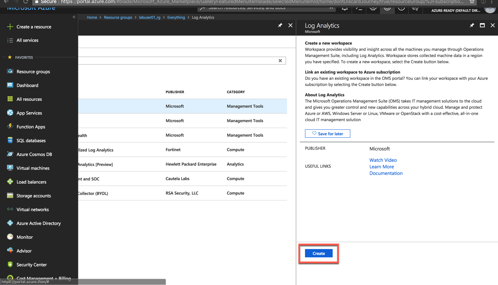

# Create container cluster

We are going to create an Azure AKS instance via the Azure Portal. In real-world projects, you would avoid the Portal UI for such tasks and use an automation strategy. We will discuss CLI-, ARM- and Terraform-based deployments in the Workshop.

More details: [Azure Kubernetes Walkthrough](https://docs.microsoft.com/en-us/azure/aks/kubernetes-walkthrough).

1. Prepare a Log Analytics Workspace that will be utilized by AKS' Container Monitoring feature.





2. Create the AKS cluster. Please follow the steps carefully and make sure to replace labuser01 with your lab user identifier.


3. Switch to your Linux VM once the AKS deployments has finished. Export the kubectrl credentials files.

```sh
az aks get-credentials --resource-group=$KUBE_GROUP --name=$KUBE_NAME
```

4. Now you can look at the cluster config file under

```sh
cat ~/.kube/config
```

5. Check that everything is running ok

```sh
kubectl cluster-info
```

6. Launch the dashboard

```sh
kubectl proxy
```

Go to kubernetes dashoard
http://localhost:8001/api/v1/namespaces/kube-system/services/kubernetes-dashboard/proxy/#!/pod?namespace=default 
